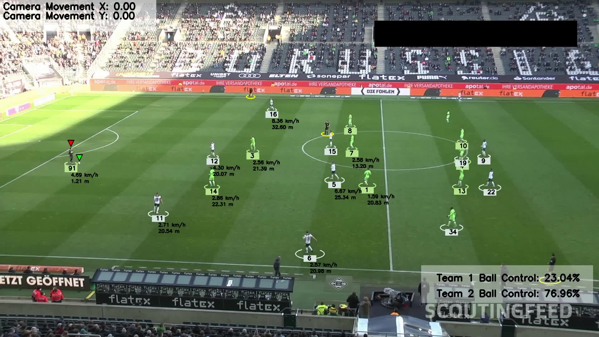

# ML Soccer Analysis



This project implements advanced machine learning algorithms for real-time object detection and tracking of soccer match footage. Using a YOLO model trained on a custom dataset, the system accurately identifies and tracks key objects on the field, including players, referees, and the ball. It also overlays critical statistics, such as ball possession and player movement metrics, directly within the video frame for real-time analysis.


## Features

- Object Detection & Tracking: Detects players, referees, and the ball using YOLO and Roboflow.
- Visual Annotations and Statistics:
    - Ball possession percentage for each team
    - Real-time player speed and distance traveled
    - Nearest player in possession of the player
- Team Identification: Utilizes KMeans clustering to distinguish team colors.
- Accurate Player Positioning: Employs camera perspective transformation using OpenCV to map player positions relative to the soccer field.
- Movement Compensation: Uses optical flow to account for camera movement when calculating player speed.
- Ball Tracking: Implements object interpolation for accurate ball tracking when it's momentarily occluded.
- Caching intermediate data: Used Pickle to serialize and store complex objects for efficient reuse and reliable retrieval.

## Dependencies

The project requires the following libraries:
- Yolo
- Supervision
- Numpy
- Pandas
- OpenCV
- Scikit-learn
## Usage

1. Clone the repository:
```
git clone https://github.com/yourusername/ml-soccer-analysis.git
cd ml-soccer-analysis
```

2. Train the YOLO model (skip if using given weights):
```
cd training
jupyter notebook football_training_yolo_v5.ipynb
```

3. Add best.pt (training weights) file to models folder
- [best.pt](https://drive.google.com/file/d/1DC2kCygbBWUKheQ_9cFziCsYVSRw6axK/view?usp=sharing)

4. Run main.py
```
python main.py
```


